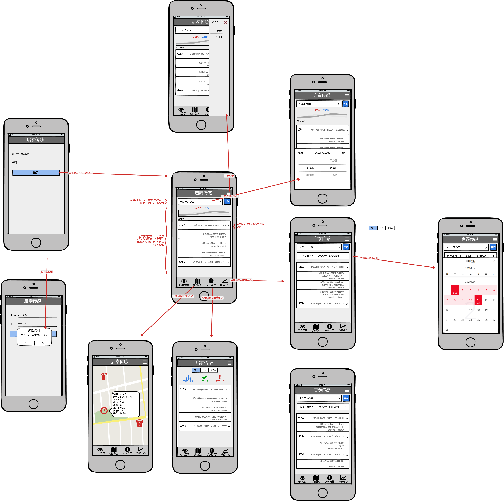

# 启泰智慧消防APP（chntek-fire-fighting）

## 要求

参照启泰智慧消防的”原型设计图”完成相应的界面与功能，并提供代码。

## 时间

### 启泰智慧消防APP-预览版-0.0.1～0.0.2（工期13天，工作量13天）

* 根据工作计划表的任务量的进行时间的估算（非精确时间）。超过的时间不额外计费，完成后，免费维护2个月。
* 界面修改，功能操作优化。

### 启泰智慧消防APP-0.0.3～1.1.0（工期7天，工作量4+11天）

* 增加登陆界面，功能操作优化。
* 美化UI，兼容平板布局，重构后端接口。

### 启泰智慧消防APP1.1.2（工期7天，工作量3+6天）

- 增加流量总/差，GIS阀门状态。
- 不同设备显示不同字段。

### 泰智慧消防APP1.1.7（工期7天，工作量3+2天）

- 增加液位计设备。
- 按时间排序告警。

## 人员

刘楚门，周兴邦，何云龙，熊畅明，启泰传感后台开发人员。

## 工作安排

| 项目                         | 任务       | 问题                                                         | 时间 | 人员                 |
| ---------------------------- | ---------- | ------------------------------------------------------------ | :--- | -------------------- |
| 启泰智慧消防APP-预览版-0.0.1 | 其他       | ~~界面-顶部导航~~  <br />~~界面-底部导航~~                   | 2天  | 周存根               |
|                              | 综合显示   | ~~界面-温度图表~~  <br />~~界面-压力图表~~  <br />~~界面-电量图表~~  <br />~~界面-其他数据表格~~  <br />~~界面-设备查询~~  <br />~~功能-查询设备数据~~ | 3天  | 周存根               |
|                              | GIS模块    | ~~界面-地图~~<br />~~界面-设备信息~~<br />~~功能-查询设备数据~~ | 2天  | 周存根               |
|                              | 告警模块   | ~~界面-当天告警~~  <br />~~界面-历史告警~~  <br />~~界面-告警详情~~  <br />~~功能-查询告警状态~~  <br />~~功能-告警通知~~ | 3天  | 周存根               |
|                              | 数据中心   | ~~界面-设备告警统计~~  <br />~~功能-查询设备告警统计~~       | 1天  | 周存根               |
|                              | 接口定义   | ~~接口-查询设备告警统计~~  <br />~~接口-查询告警状态~~  <br />~~接口-查询设备数据~~ | 2天  | 刘楚门               |
|                              | 接口实现   | ~~接口-查询告警状态  <br />~~接口-查询设备数据~~  <br />~~接口-查询设备告警统计~~  <br />接口-~~获取所有设备编号~~<br />~~GIS地图密钥~~ | 不定 | 刘楚门<br />启泰传感 |
|                              | 测试真机   | ~~谷歌~~<br />~~小米~~<br />~~红米~~<br />~~魅族~~<br />     | 不定 | 刘楚门               |
| 启泰智慧消防APP-预览版-0.0.2 | 综合显示   | ~~功能-查询区域设备当天状态~~                                | 1天  | 周存根<br />刘楚门   |
|                              | GIS模块    | ~~功能-查询设备状态-设备类型图标修改~~                       | 1天  | 周存根<br />         |
|                              | 告警模块   | ~~功能-统计告警状态-总数~~<br />~~功能-统计告警状态-正常~~<br />~~功能-统计告警状态-异常~~ | 2天  | 周存根<br />刘楚门   |
|                              | 数据中心   | ~~功能-查询区域设备历史状态~~                                | 1天  | 周存根<br />刘楚门   |
|                              | 接口实现   | ~~后端-查询所有区域信息~~<br />~~后端-查询区域设备数据~~<br /> | 不定 | 刘楚门<br />启泰传感 |
| 启泰智慧消防APP-预览版-0.0.3 | 登陆       | ~~界面-用户验证~~                                            | 1天  | 周存根               |
|                              | 综合显示   | ~~功能-按照位置选择设备而不是设备名~~                        | 1天  | 周存根               |
|                              | 告警模块   | ~~合并同一个设备的报警信息~~                                 | 1天  | 周存根               |
|                              | 接口实现   | ~~后端-用户登陆~~<br />~~后端-查询实时状态~~                 | 1天  | 刘楚门<br />启泰传感 |
| 启泰智慧消防APP-预览版-1.1.0 | UI兼容平板 | ~~界面-用户登陆~~<br />~~界面-历史数据~~<br />~~界面-实时数据~~<br />~~界面-告警列表~~<br />~~界面-新版本提示~~ | 4天  | 周兴邦               |
|                              | 在线升级   | ~~功能-下载新版本~~<br />~~功能-上传新版本~~                 | 4天  | 刘楚门               |
|                              | 接口实现   | ~~接口-获取APP版本~~<br />~~接口-下载APP版本~~<br />~~接口-上传APP版本~~ | 3天  | 刘楚门               |
|                              | 应用商店   | 腾讯应用宝<br />百度应用商店                                 | 不定 | 刘楚门               |
| 启泰智慧消防APP-1.1.3        | 界面       | ~~综合显示-流量总/差~~<br />~~GIS模块-阀门状态~~<br />~~GIS模块-流量总/差~~ | 2天  | 刘楚门               |
|                              | 接口实现   | ~~后端-流量总/差~~<br />~~后端-阀门状态~~                    | 1天  | 刘楚门               |
| 启泰智慧消防APP-1.1.4        | 界面       | ~~GIS-动态显示字段~~<br />~~GIS-温度改成压力~~<br />~~GIS-设备类型字段~~<br />~~历史数据-动态显示字段~~<br />~~历史数据-增加设备类型的筛选~~<br />~~历史数据-设备类型字段~~ | 3天  | 周兴邦               |
| 启泰智慧消防APP-1.1.6        | 优化       | ~~数据项的分隔线不明显~~<br />~~切换页面时数据刷新慢~~       | 1天  | 熊畅明               |
| 启泰智慧消防APP-1.1.4        | 接口实现   | ~~后端-压力表~~<br />~~后端-上法兰消防栓~~<br />~~后端-下法兰流量终端~~ | 2天  | 刘楚门               |
| 启泰智慧消防APP-1.1.7        | 前端       | 界面-实时告警-按时间排序<br />界面-实时告警-按告警类型搜索<br />界面-历史数据-液位计<br />界面-历史数据-消防气瓶<br />界面-GIS-液位计<br />界面-GIS-消防气瓶 | 4天  | 周兴邦               |
|                              | 接口实现   | 后端-液位计<br />后端-消防气瓶<br />后端-固定APP下载地址     | 3天  | 何云龙/刘楚门        |
|                              |            |                                                              |      |                      |

# 前端



# 后端

## 接口定义

### 用户

#### 登陆

```python
HTTP GET http://iot.chntek.com:3410/api/User/login  
#输入
account: 'zhangsan'		#用户名
password: 'xf.sky.l' 	#密码  
#输出
{  
    err: null,				#成功null，否则错误信息
	val: 'token123',		#登陆令牌
}
```

### 设备

#### 获取区域设备编号

```python
HTTP GET http://iot.chntek.com:3411/devices/regions
#输入
account: 'CSCB001'		#用户名
#输出
{
  "err": null,
  "val": {
    "长沙市": {
      "浏阳": [
          "00006","00008","00012",
          "00017","00018","00022",
          "00023","00025","00026",
          "00033"
      ],
      "望城区": [
          "00011","00014","00020",
          "00021","00027","00028",
          "00029","00034","00036",
          "00039","00044","00051"
      ]
    }
  }
}
```

#### 设备查询

```python
#查询设备信息
HTTP GET http://iot.chntek.com:3411/devices/primary
#输入
ids: '设备A,设备B' #被查询的设备编号，多个用逗号分隔
#输出
{
    "err": null,		
    "val": [
        {
            "id": "设备A",#设备编号
            "longitude": "E113.74880433",#设备经度
            "latitude": "N28.2842444",	#设备纬度
            "city": "长沙市",
            "county": "浏阳",
            "location": "长沙银行古港支行1F现金区卫生间",
            "type": "firehydrant", #设备类型 firehydrant：上法兰消防栓，pressure：无线压力表，cylinders：消防气瓶，LowerFlange：下法兰消防栓
		},
        {
            "id": "设备B",#设备编号
            "longitude": "E113.74880433",#设备经度
            "latitude": "N28.2842444",	#设备纬度
            "city": "长沙市",
            "county": "浏阳",
            "location": "长沙银行古港支行1F现金区卫生间",
            "type": "firehydrant"
		}
    ]
}
```

#### 状态查询-最近

```python
#查询最近的设备状态
HTTP GET http://iot.chntek.com:3411/devices/status-recent
#输入
id: '设备A' #被查询的设备编号
size: 2 #限制查询数据量为2条
#输出
{
    "err": null,		
    "val": [
        {
            # pressure：无线压力表
            "hydraulic_pressure":0.257, 		 #水压 MPa
            "temperature":15.8,				 #温度  °C
            "energy":70,    	 			 #电量  %
            "signal_intensity":3,  		 #信号强度 db       
            "time": "2010-12-10 14:20:00"		#检测时间
        },
        { 
            # firehydrant：上法兰消防栓
            "hydraulic_pressure":0.257, 		 #水压 MPa
            "temperature":15.8,				 #温度  °C
            "energy":70,    	 			 #电量  %
            "signal_intensity":3,  		 #信号强度 db
            "sluice":"关",			#阀门状态
            "time": "2010-12-10 14:20:00"		#检测时间
		},
		{
            # LowerFlange：下法兰消防栓
            "hydraulic_pressure":0.257, 		 #水压 MPa
            "temperature":15.8,				 #温度  °C
            "energy":70,    	 			 #电量  %
            "signal_intensity":3,  		 #信号强度 db    
            "sluice":"关",			#阀门状态
            "flow":0.0,				#单位m³
            "flow_difference":0.0,	 #单位m³
            "time": "2010-12-10 14:20:00"		#检测时间
		},
		{
            # cylinders：消防气瓶
		},
		{
            # LiquidLevel：液位计
            "main_measure": "1.452596", #主测量信息
            "temperature": "22.5", #压力
            "signal_intensity": "96", #信号强度
            "energy": 100,			#能量
            "time": "2021-05-09 23:59:14" #检测时间
		}
    ]
}
```

#### 状态查询-历史

```python
#查询历史的设备状态
HTTP GET http://iot.chntek.com:3411/devices/status-history
#输入
id: '设备A' #被查询的设备编号
size: 2 #限制查询数据量为2条
date_begin: '2010-12-24' #指定日期的状态
date_end: '2010-12-24' #指定日期的状态
#输出
{
    "err": null,		
    "val": [
        {
            # pressure：无线压力表
            "hydraulic_pressure":0.257, 		 #水压 MPa
            "temperature":15.8,				 #温度  °C
            "energy":70,    	 			 #电量  %
            "signal_intensity":3,  		 #信号强度 db       
            "time": "2010-12-10 14:20:00"		#检测时间
        },
        { 
            # firehydrant：上法兰消防栓
            "hydraulic_pressure":0.257, 		 #水压 MPa
            "temperature":15.8,				 #温度  °C
            "energy":70,    	 			 #电量  %
            "signal_intensity":3,  		 #信号强度 db
            "sluice":"关",			#阀门状态
            "time": "2010-12-10 14:20:00"		#检测时间
		},
		{
            # LowerFlange：下法兰消防栓
            "hydraulic_pressure":0.257, 		 #水压 MPa
            "temperature":15.8,				 #温度  °C
            "energy":70,    	 			 #电量  %
            "signal_intensity":3,  		 #信号强度 db    
            "sluice":"关",			#阀门状态
            "flow":0.0,				#单位m³
            "flow_difference":0.0,	 #单位m³
            "time": "2010-12-10 14:20:00"		#检测时间
		}
    ]
}
```

#### 告警状态

```python
#查询指定日期的告警状态
HTTP GET http://iot.chntek.com:3411/devices/warnings
#输入
id:'设备A'
date:'2020-10-01' 	#指定日期的告警状态，返回该日的数据
size: 2 #数量数据限制
type:'信号低报警' #告警类型
#输出
{
    "err":null,
    "val":[
        {
            "conductivity":"7.4",
            "energy":99,
            "hydraulic_pressure":"0.153",
            "signal_intensity":6,
            "temperature":"11.4",
            "type": "信号低报警、负温标志、压力传感器报警",
            "time": "2020-12-27 06:57:02",
            "location": "长沙市浏阳长沙银行古港支行1F现金区卫生间"
        },
        {
            "conductivity":"7.4",
            "energy":99,
            "hydraulic_pressure":"0.153",
            "signal_intensity":6,
            "temperature":"11.4",
            "type": "信号低报警、负温标志、压力传感器报警",
            "time": "2020-12-27 04:58:12",
            "location": "长沙市浏阳长沙银行古港支行1F现金区卫生间"
        }
    ]
}
```

### 版本管理

#### 上传版本

```python
#上传一个新版本，文件名格式：chntek-<版本号>.apk
HTTP GET http://iot.chntek.com:3411/app/upload
Content-Type: multipart/form-data; boundary=----WebKitFormBoundary7MA4YWxkTrZu0gW
#输入
------WebKitFormBoundary7MA4YWxkTrZu0gW
Content-Disposition: form-data; name="file"; filename="chntek-1.0.0.apk"
Content-Type: application/octet-stream

< ./chntek-1.0.0.apk
------WebKitFormBoundary7MA4YWxkTrZu0gW--
#输出
{
    "err":null,
    "val":true
}
```

#### 最新版本

```python
#获取最新版本
HTTP GET http://iot.chntek.com:3411/app/latest
#输入
#输出
{
    "err":null,
    "val":'http://dungbeetles.xyz:3410/app/chntek-1.0.0.apk'	#下载路径
}
```

